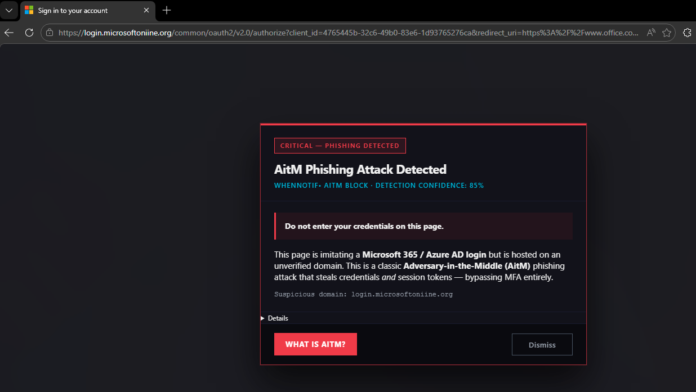

# PhishGuard

**A browser extension that detects Adversary-in-the-Middle (AitM) phishing attacks targeting Microsoft 365 and Entra ID.**

> *Real threats. Real fixes. No theater.* — [whennotif•](https://whennotif.io)

---

## The problem

Standard phishing sends you to a fake login page where you type your password into a form controlled by the attacker. MFA defeats this — but AitM phishing does not send you to a fake page. It sends you to a **real-time proxy** that sits between you and the actual Microsoft login.

```
You  ──→  evil-login.net  ──→  login.microsoftonline.com
          (AitM proxy)         (real Microsoft)
```

From your browser's perspective the page looks and behaves exactly like the real Microsoft login — because it *is* the real Microsoft login, just relayed through an attacker-controlled server. You log in successfully. MFA completes. And the attacker captures both your password and your authenticated session cookie — **bypassing MFA entirely**.

Toolkits like [Evilginx](https://github.com/kgretzky/evilginx2), Modlishka, and Muraena make this trivially easy to deploy.

---

## What this extension does

PhishGuard runs silently in the background and scans every page you visit. When a page looks like a Microsoft login but is **not** hosted on a verified Microsoft domain, it blocks the page with a full-screen warning before you can type anything.

The warning is shown with a **30-second forced delay** and clearly explains what is happening and what to do.



---

## Installation

### Chrome / Edge


1. Download the latest `phishguard-community-chrome-vX.X.X.zip` from the [Releases](../../releases) page.
2. Extract the ZIP to a permanent folder (do not delete it after loading).
3. Open `chrome://extensions` (or `edge://extensions`).
4. Enable **Developer mode** (toggle in the top-right corner).
5. Click **Load unpacked** and select the extracted folder.

The extension is active immediately — no restart required.

### Firefox


1. Download `phishguard-community-firefox-vX.X.X.zip` from [Releases](../../releases).
2. Extract the ZIP.
3. Open `about:debugging` → **This Firefox** → **Load Temporary Add-on**.
4. Select any file inside the extracted folder (e.g. `manifest.json`).

Note: temporary add-ons are removed when Firefox restarts. For a persistent installation, the extension must be signed by Mozilla AMO or deployed via enterprise policy.

---

## How detection works

PhishGuard uses a **scoring engine** with 12 independent signals. Each signal adds points when a characteristic of the Microsoft login page is detected on a non-Microsoft domain. If the total score reaches the threshold, the warning is triggered.

| Signal | Points | What is checked |
|---|---|---|
| JS runtime globals | 4 | `$Config` / `ServerData` objects, or ≥ 3 inline script markers (`hpgact`, `sFT`, `apiCanary`, `ConvergedSignIn` …) |
| Tenant branding data | 3 | `$Config.aTenantBranding[0]` contains `TenantId`, `BannerLogo`, or `UserIllustrationUrl` — Microsoft-internal runtime data |
| ConvergedSignIn PageID | 3 | `<meta name="PageID" content="ConvergedSignIn">` |
| Microsoft CDN resources | 3 | Scripts or stylesheets loaded from `aadcdn.msftauth.net` / `aadcdn.msauth.net` |
| MS-specific DOM IDs | 3 | ≥ 2 of: `#i0116`, `#i0118`, `#idSIButton9`, `#lightbox`, `[name="loginfmt"]`, `#KmsiCheckboxField` … |
| Body classes | 2 | `body.win10`, `body.win7`, `body.mac` or `data-bind` attribute on body (Knockout.js / MS pattern) |
| Microsoft blue button | 2 | Submit button colour within ±10 of `#0067b8` (Microsoft sign-in blue) |
| Branding / logo | 2 | `` alt/src/class matching Microsoft or tenant branding patterns |
| OAuth hidden inputs | 2 | ≥ 2 hidden inputs named `PPFT`, `canary`, `ctx`, `client_id`, `flowtoken` … |
| Login form structure | 1 | Password or email field present |
| Title match | 1 | "Sign in" / "Microsoft" / "Anmelden" in `document.title` |
| Sign-in button text | 1 | Button label contains "Sign in", "Next", "Weiter" … |

**Threshold: 7 points.**

A real Microsoft login page scores 18 – 24. An AitM proxy mirrors the full DOM verbatim — including the `$Config` runtime object with tenant branding data — and typically scores 10 – 17, well above the threshold.

### Why AitM proxies are caught despite mirroring the real page

The key insight is the **tenant branding signal**. When Microsoft renders a login page, it embeds the target tenant's data into the page as a JavaScript object:

```javascript
// Simplified — real $Config has dozens of fields
$Config = {
  aTenantBranding: [{
    TenantId:            "3e2c3b68-...",
    TenantDisplayName:   "Contoso Ltd.",
    BannerLogo:          "https://aadcdn.msftauthimages.net/...",
    UserIllustrationUrl: "https://aadcdn.msftauthimages.net/...",
    BoilerPlateText:     "Sign in with your Contoso account",
  }],
  sFT:     "...",   // flow token
  sCtx:    "...",   // context token
  apiCanary: "...", // anti-CSRF
}
```

An AitM proxy relays this response verbatim. Your browser receives a page with Microsoft's tenant data embedded in it — on a domain that is not `microsoftonline.com`. That combination is the detection.

### Legitimate domains are never flagged

The extension maintains a list of verified Microsoft domains. If you are on any of these domains, the extension skips the phishing check entirely (and optionally shows a trusted badge in the Pro edition):

`login.microsoftonline.com` · `login.live.com` · `login.microsoft.com` · `microsoft.com` · `live.com` · `office.com` · `msauth.net` · `office365.com` · and more.

---

## What you see when phishing is detected

A full-screen overlay blocks the page with a forced 30-second countdown before the dismiss option becomes available.

The collapsible **Detection signals** section lists every signal that fired, with its point value — useful for understanding why a page was flagged or reporting a false positive.

---

## Privacy

**This extension collects no data. Zero.**

- No analytics, no telemetry, no crash reporting.
- No network requests are made by the extension itself.
- No browsing history is stored or transmitted.
- Detection runs entirely locally in your browser.

The only external request the extension can make is the "What is AitM?" button, which opens a standard browser tab to [whennotif.io](https://whennotif.io/blog/aitm-phishing).

---

## False positives

If you encounter a legitimate page that triggers the warning, please [open an issue](../../issues) with the domain (never paste credentials or personal data). Known causes of false positives:

- Internal corporate SSO portals that clone the Microsoft login UI
- Development/staging environments mimicking Microsoft login for testing
- Screenshot or demo pages that embed the MS login interface

You can safely dismiss the warning and continue — the extension does not block navigation.

---

## Limitations

- **Detection only, not prevention.** The extension shows a warning; it does not prevent you from proceeding.
- **Obfuscated proxies.** A sufficiently sophisticated proxy that strips `$Config`, changes DOM IDs, and replaces CDN URLs will reduce the score. Multiple independent signals make this hard to evade completely without breaking the login flow, but it is not impossible.
- **Content script timing.** The extension scans at multiple intervals (0ms, 800ms, 2.5s, 5.5s, 10s) to handle SPAs and lazy-loaded content. A very slow proxy might render after all intervals have passed.
- **No URL-based detection.** The extension does not maintain a blocklist of known phishing URLs. It relies entirely on page content analysis.

---

## Frequently asked questions

**Does this work against all AitM toolkits?**
It works against any proxy that serves the Microsoft login page without significantly modifying the DOM structure, JavaScript globals, or hidden form fields — which includes Evilginx2/3, Modlishka, and Muraena in their default configurations. Heavily customised proxies that strip MS-specific markers would score lower, but removing all 12 signals while maintaining a functional login page is difficult.

**Does it slow down my browser?**
No measurably. The detection runs once per page load (plus a few delayed retries) and reads from the existing DOM — it does not make network requests, inject persistent observers, or run in the background between pages.

**Why is there a 30-second forced delay before I can dismiss?**
Because AitM phishing works by creating urgency. The delay forces a pause and ensures the warning is read before proceeding.

**Is there a version with more features?**
Yes — a Professional edition for enterprise deployment exists with webhook alerting, Intune/MDM deployment support, user reporting with screenshot capture, trusted badge, multi-language support (EN/DE), and customisable branding. Contact me for details.

---

## Contributing

Issues and pull requests are welcome.

- **Bug reports:** [open an issue](../../issues) — include browser version, OS, and the domain that triggered (or failed to trigger) the warning.
- **False positive / false negative reports:** same — a domain is sufficient, no need to include personal data.

---

## License

MIT — free to use, modify, and distribute. See [LICENSE](LICENSE).

---

*PhishGuard Community Edition is a project by [whennotif•](https://whennotif.io)*


